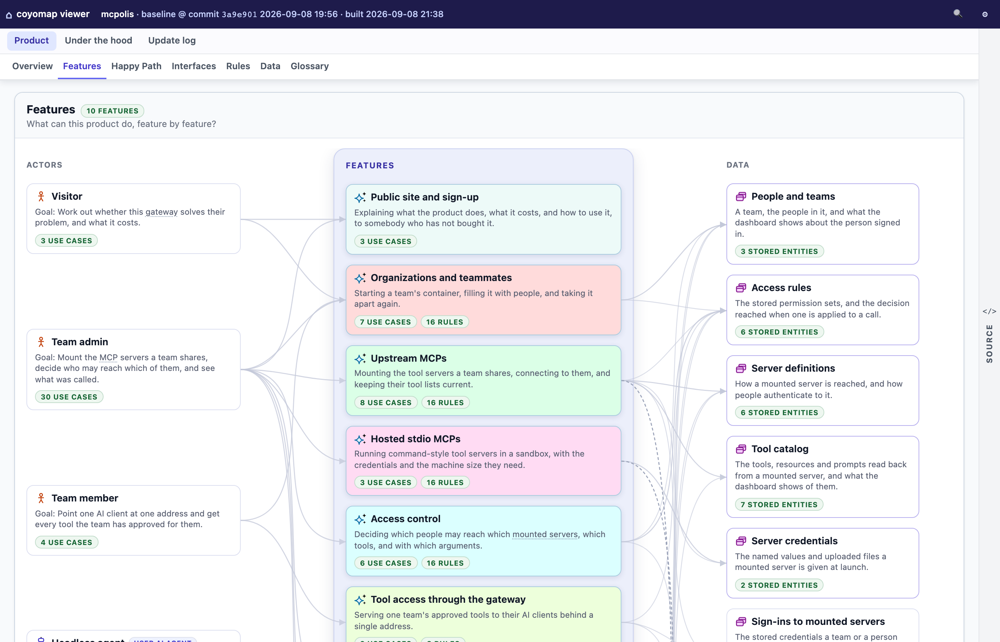
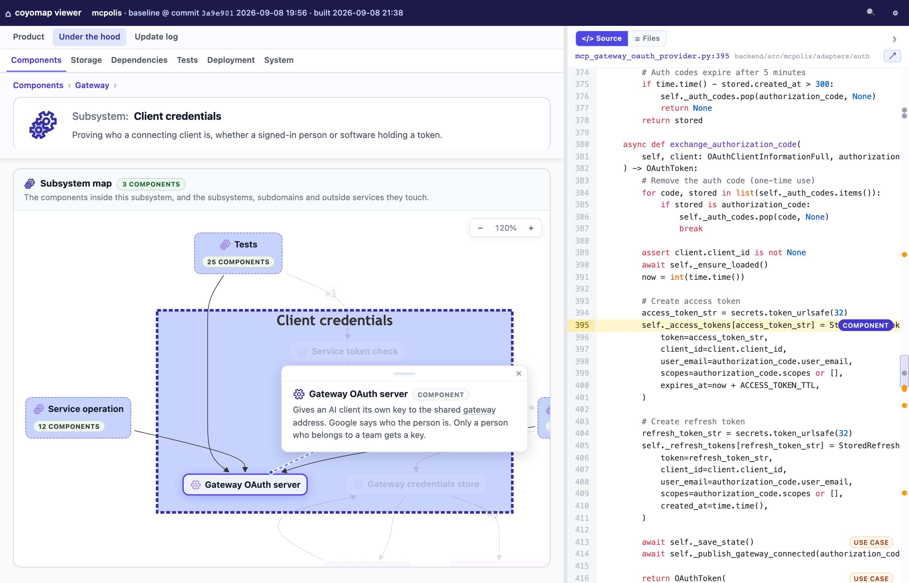
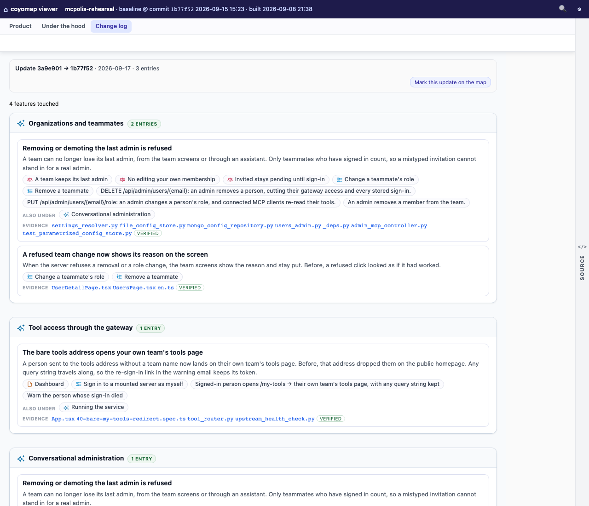

<div align="center">


# coyomap: agentic coding without running off the cliff

A map of your project, from features down to the code

</div>

## Why coyomap?

When coding agents generate most of your code, you can lose track of your project's features
and implementation. Everything runs fine until the day you look down and see there is nothing under
your feet. This is the Coyote Effect.

coyomap helps you avoid the Coyote Effect: you keep visibility into the project and find your way
around it as it grows.

## What is coyomap?

coyomap analyzes your project and builds an interactive map of its features, in plain language,
linked to the underlying architecture and code. Use it to understand what your project does and
how it is implemented, top-down, without reading all the code. Drill into the code only where and
when you actually need to.

It is also a shared picture of the project for your non-developer teammates. Hand it to them as a
link: coyomap writes the map out as a plain website you can host anywhere, and a reader needs no
repo and nothing installed.

## What coyomap shows

The viewer shows your project in three views: *Product*, *Under the hood* and *Change log*.

**Product** shows the project's functionality: who uses it, its features and use cases, the happy
path, the rules it enforces, and the data it keeps.



**Under the hood** shows how the project is built and run: its components and their dependencies,
where data is stored, how it is deployed.



**Change log** shows how the product changed, one entry per run of `coyomap update`, newest first.
An update's page tells its story by feature, in plain words: what the product now does differently,
which boxes it touched, the evidence, with the map's own diff for that step underneath.



You can start from a feature and drill down: the interfaces and data it touches, the components that do the
work, and the code behind each.

## Why not just ask my agent to explain the code?

You can ask your agent to analyze the code, generate summaries and draw diagrams. However, coyomap
differs in two ways:

- coyomap builds an explorable, hierarchical map: every box has a plain-language note, links to
  related elements, and links into the architecture and code. The map is saved with the project, so
  everyone sees the same one.
- An AI agent can miss things or make things up. So coyomap reads the code with the help of an
  index, makes every claim point at a real file and line, checks the map for gaps and
  contradictions, and has fresh agents try to prove each claim wrong before the map is written.

## How to use

coyomap runs as an agent skill on Claude Code, Codex, and Cursor. Install it once, then drive
everything with `/coyomap`. You need a checkout of the project and one of the three agents. Having
written the code, or reading it, is not required.

### Installing

**Requirements:**

- **Python 3.10+.** `make install` builds an isolated virtualenv (`.venv/`) in the repo, so nothing
  lands in your system Python.
- **git**, and a **macOS/Linux** shell.

**Install the skill (once).** Clone this repo, then from its root run:

```
make install
```

This installs the skill into each agent's global skills home (`~/.claude/skills` for Claude Code,
`~/.agents/skills` for Codex and Cursor).

It also builds a repo-local virtualenv with the `coyomap` CLI. After you update the clone
(`git pull`), or if you move it, run `make install` again: it refreshes both the tool and the skill.

### Building a map

**1. Build the baseline.** In your project, with no map yet, `/coyomap` builds it:

```
/coyomap
```

Before reading anything, coyomap prints what it is about to read: how many files, what each ignore
pattern removed, and which commit the map will be pinned to. If you have uncommitted changes, it
asks whether to wait for a commit.

The map lands in `.coyomap/`, pinned to that commit: the map itself (JSON), a readable markdown
rendering of it, the code index, a stamp saying which session built it, and the verdicts of the
verification pass. Commit the folder with your code. The interactive viewer isn't a committed file;
it's served live from the map (below). With a map already there, `/coyomap` tells you whether the
map still matches the code; it never rebuilds on its own.

The initial build is the agent's biggest job: up to an hour and a good number of tokens, once per project.
After that, the map is kept with the code, and asking for changes is cheap.

**2. View the map.** A small local server renders the viewer. Start it once, from the coyomap clone:

```
make start
```

It opens a landing page at `http://127.0.0.1:8765/`. Pick your project's folder there once; the
server remembers it and shows it as a card from then on. Leave the server running. A map's address
starts with `/coyomap/`, and `.venv/bin/coyomap url <ID> --repo <repo>` prints the address of one
element, already selected — ask your agent to "show me X in the map" and it ends with that link.

**3. Share it.** To show the map to someone who has neither your repo nor coyomap, export it as an
ordinary website:

```
.venv/bin/coyomap export <your project> --out ./site
```

That writes a folder of plain files: the viewer, the map, and your code at the commit the map is
pinned to. Nothing runs on the server. Put the folder on GitHub Pages, Netlify, a cloud bucket or an
internal web server, and send the link.

Who may open it is your host's business, so a private project's map can live somewhere private.

Everything a reader can do on your own screen works on the shared copy: every view, the drill-downs,
the source code, the search, and links that open on one exact screen. The one exception is the
change-impact explorer, which needs git behind it.

The folder is a website, so it has to be served rather than opened as a file — the page says so, and
tells the reader how, if they try. It is also a snapshot pinned to one commit, so export again after
the map changes.

### Asking for map changes

You can also **just ask for changes** in plain language, and coyomap edits the map for you:

```
/coyomap move the payments module into a new "Billing" subsystem
/coyomap the "utils" component is really two things, split it
/coyomap rename the "API" subsystem to "Public API"
/coyomap add a use case for an admin resetting a user's password
/coyomap drill deeper into the "Billing" subsystem — I need more detail there
```

Every edit runs the same checks as a build. Ask for a feature the code does not have, and coyomap
says so instead of drawing it.

**A rebuild is a fresh start.** If you later rebuild the map from scratch (which you have to ask for
explicitly), your manual tweaks aren't re-applied.

On any agent beyond the three above, these steps also work by pasting *"Read `method.md` and follow it
to …"* to any agent that can read this repo.

## Which files are analyzed

coyomap takes every file in your project, except two sets: what your `.gitignore` excludes, and what
`.coyomap/.ignore` excludes. git decides the first one, so all the usual rules hold, including a
`.gitignore` inside a subfolder. `.coyomap/.ignore` uses the same syntax, and is for the other case:
code that *is* committed, but that you don't want on the map — a vendored copy, checked-in build
output, a fixture tree. The build reports what each pattern removed, so an exclusion never goes
unnoticed.

## Status

coyomap is **work in progress**, in daily use. The stored map format still moves: a newer coyomap
may not read an older map, and a rebuild is the fix, so treat a map as replaceable. Map quality
depends on the coding agent and model: read it, and correct it.

Feedback and bug reports are welcome, please [open an issue](../../issues).
