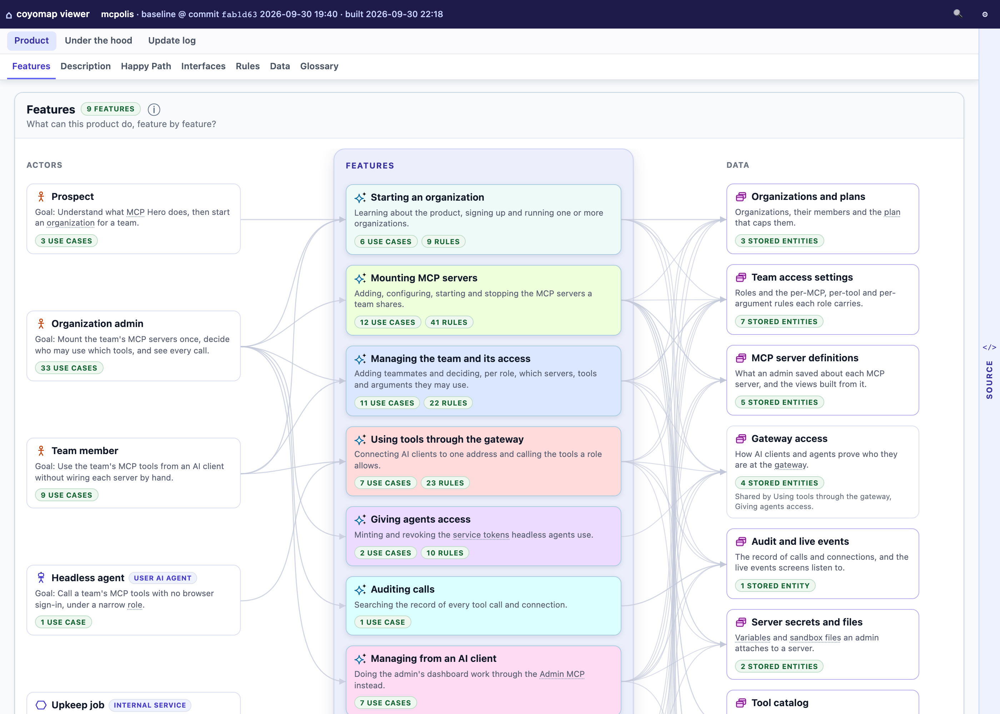
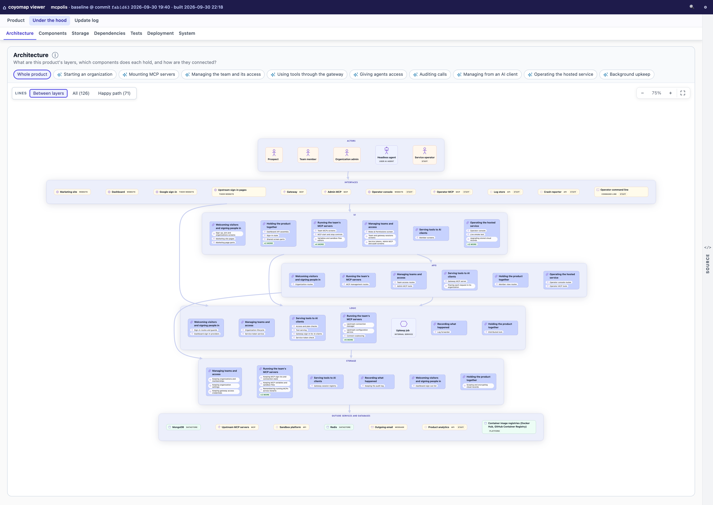

# coyomap: agentic coding without running off the cliff

A map of your project, from features down to the code

## Why coyomap?

When coding agents generate most of your code, you can lose track of your project's features
and implementation. Everything runs fine until the day you look down and see there is nothing under
your feet.

coyomap helps you keep visibility into the project and find your way around it as it grows.

## What is coyomap?

coyomap analyzes your project and builds an interactive map of its features and use cases, linked to the underlying architecture, data model and code. Map components are annotated with plain language descriptions of their goal and function. Use the map to understand what your project does and how it is implemented, top-down, drilling down into the code only when needed.

The map also provides a shared picture of the project for your non-developer teammates.

## What coyomap shows

The viewer shows your project in three sections: *Product*, *Under the hood* and *Update log*.

**Product** shows the project's functionality: who uses it, its features and use cases, the happy
path, the rules it enforces, and the data it keeps.

<p align="center">
  <br>
  <em>Features diagram for the <a href="https://github.com/nseniak/mcphero">MCP Hero project</a>.</em>
</p>

**Under the hood** shows how the project is built and run: its architecture, components, dependencies, how its data is stored, and how it is deployed.

<p align="center">
  <br>
  <em>Architecture diagram for the <a href="https://github.com/nseniak/mcphero">MCP Hero project</a>.</em>
</p>

**Update log** shows how the product changed, one entry per update of the map (`/coyomap update`), newest first.

## Why not just ask my agent to explain the code?

You can ask your agent to analyze the code, generate summaries and draw diagrams. However, coyomap
differs in two ways:

- coyomap builds an explorable, hierarchical map, with cross-reference links and plain-language annotations. The map is saved as a set of files that can be committed and shared with the project, so everyone sees the same one.
- An AI agent can miss things or make things up. coyomap combines code indexing, automated consistency checks, and independent agent reviews to find gaps and unsupported claims.

## How to use

coyomap runs as a skill on Claude Code, Codex and other coding agents.

### Install

To install coyomap, clone this repo and run `make install`. This installs the CLI in a local virtual environment and copies the skill into the supported agents’ skill folders. Keep this clone in place.

```
# Install coyomap
git clone https://github.com/nseniak/coyomap.git
cd coyomap
make install
```

The coyomap CLI runs on Python 3.10+, which needs to be installed on your machine.

Run `make install` again after each new `git pull`.

### Build your project map

To create the map of your project, run the `/coyomap` command in your project's agent. Use a capable coding model at its default effort setting (e.g., Opus 5.5 at medium effort). Allow about an hour for the initial build; larger projects can take longer, depending on the model and agent.

```
# Build the map
cd ~/my-project
claude
/coyomap
```

The map is created in your project's `.coyomap/` subdirectory. Commit it with your code if you want to share it.

#### Long builds in Claude Code

A large build can fill the main session's context. Each tool, connector and plugin a session loads is described in that context, and each helper agent pays for the same descriptions on every turn. Two optional steps cut that cost; neither changes the map.

- **Start the build session with only what a build uses:** the file and shell tools and the agent tool. `claude --strict-mcp-config` starts with no MCP servers; `claude plugin details <name>` shows what a plugin costs, and `claude plugin disable <name>` turns it off.
- **Give the helpers only file and shell tools:** define an agent such as `.claude/agents/coyomap-helper.md` with `tools: Read, Write, Edit, Bash, Grep, Glob`, and tell the build when you start it to run its helpers as that agent. The fact-check wave runner is the exception: it starts the fact-checkers, so it also needs `Agent`.

**Not measured yet:** whether a helper limited by `tools:` really starts with a smaller context. It is expected and has not been shown; if you try it, compare the fixed base per agent turn that `coyomap-eval cost` prints.

### Explore the map

Open the map in your browser with the coyomap viewer. It runs on your machine and shows every map you have opened.

```
# Start the viewer
cd coyomap && make start
```

Your browser opens at `http://127.0.0.1:8765`. Click your project to see its map. If your project is not listed, add its folder from that page.

Alternatively, you can ask your agent to start the viewer for you.

### Keep the map in sync

After committing code changes, run an incremental update of the map.

```
# After committing code changes
/coyomap update
```

### Interacting with the map

You may use the coyomap skill to ask questions about the map and request updates.

```
# ask for a change to the map itself
/coyomap rename the "API" subsystem to "Public API"
```

### Share the map

Export the map as a static website that others can browse without installing coyomap.

```
# To export the map
cd coyomap && .venv/bin/coyomap export ~/my-project --out ./site
```

This command generates a folder of plain files: the viewer, the map, and your code. Put it on GitHub Pages or any web host and send the link. Nothing runs on the server. It is a snapshot, so export again after the map changes.

## Which files are analyzed

coyomap analyzes your project's source files, excluding common dependencies and generated files.
In Git repositories, it respects Git's ignore rules for untracked files. Add further exclusions
in `.coyomap/.ignore`, which supports a subset of gitignore syntax, including wildcards and negation.
Use it for committed code you don't want on the map, such as a fixture tree. The build reports
what each pattern removed.

## Status

coyomap is **work in progress**, in daily use. The stored map format still moves: a newer coyomap
may not read an older map, and a rebuild is the fix, so treat a map as replaceable. Rebuilding can overwrite manual changes to the map.

Feedback and bug reports are welcome, please [open an issue](../../issues).
