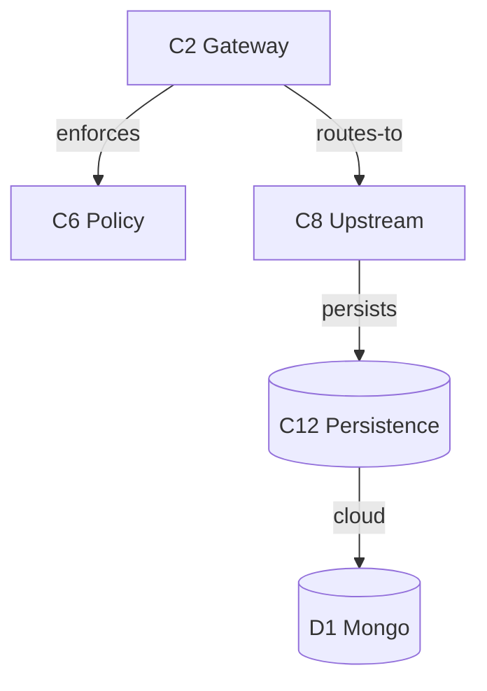

# Diagrams

A diagram is just another **rendering** of the map the model ([the map model](model.md)) already
encodes — not a new analysis. The renderer builds the graph straight from `project-map.json`; no
separate persisted model is needed.

## Drill-down maps onto C4 + a behavioral view

| Zoom level | Shows | From the map |
|---|---|---|
| **Context** | the system, actors, external deps | Product description · Roles · T2 |
| **Container** | runtime pieces (services, datastores, sandboxes) | Deployment + components |
| **Component** | T1 components + their verbed arrows | T1 + the edge list |
| **Code** | entry points → `file:line`; the **domain model as a `classDiagram`** (entities with attributes + typed, cardinal relations) — led by a **Subdomains overview** when the model is grouped into subdomains | T4 anchors · T5 [domain cards](domain-cards.md) · Subdomains |
| **Behavioral overlay** | the Happy Path as a black-box sequence of use cases; drill a step into its use case's T6 flow, drawn either as a **sequence** (actor + components/deps/entities as lifelines, the steps in order) or as a **map** (the same steps as a leaf-only box graph — what this use case touches) | HP steps + T6 flows |

Drill down = zoom one level in; step back = zoom out — the same "name a row to drill"
navigation as the markdown, made visual. The Container and Code altitudes **nest to any depth**: a
subsystem (or subdomain) that holds child subsystems drills into them recursively, each card showing one
level — so a large area keeps drilling inside the **one** map rather than spilling into a second file.

**Context-diagram direction.** Actors (from Roles) point *into* the system — they initiate use
cases. External dependencies (from T2) point *out* — the system calls them. Keeping external
systems in T2 (not Roles) is what makes those arrows render the right way: an IdP, sandbox, or
upstream service is something the system *uses*, never an actor that uses the system.

## Diff as an overlay

Recolor the baseline graph from the annotated baseline-diff: **green = added, amber =
modified, red/ghosted = deleted** (re-draw deleted nodes just for the overlay), with a
show/hide toggle. The element-keyed deltas are the data.

## Edges and source links

- **Edges come from the verbed component edge list**, so every arrow carries its verb. Do
  not derive arrows from T1's coarse "Depends on".
- **Source links pin to the analysis commit SHA** so line drift doesn't break them.

## Realization tiers

- **Tier A — diagram-as-code (Mermaid / D2), generated from the model.** SUPERSEDED by Tier B and
  kept only as the reference frame the example below uses: no build emits Tier A files, and
  nothing in the tooling writes one — the served viewer is the diagram. (It described one diagram
  per level with `click`→source, hyperlink drill instead of true zoom.)
- **Tier B — a live-served interactive viewer**, available in [`tools/coyomap/viewer/`](../tools/coyomap/viewer/).
  A generic frontend served by `coyomap serve`; it fetches its data (built straight from
  `project-map.json`) from the server and renders the C4 altitudes —
  Context → Subsystems (click a box/arrow to drill in place, derived inter-subsystem edges; drill a
  subsystem for its components → code) — plus the **Entities** view (the T5 domain model; when grouped
  into subdomains, a bounded-contexts overview that ⌥-drills (or double-click) into one subdomain's `classDiagram`; a
  subsystem card also draws the subdomains its components own/read — the derived `S→SD` bridge) and the
  **Happy Path** as its own behavioural overlay (a black-box sequence diagram of the use cases; clicking
  a step drills into its use case's T6 flow — a flow map + readable narrative — whose element
  links locate each element in its home view). A flow has ONE rendering of its step list:
  the **map** (what it touches, and in what order on the arrows — one box per
  element, kind-coloured as everywhere else, entities and dependencies included, with no container
  frames, since scoped to one use case a subsystem frame holds one or two members and reads as noise;
  each box names its area instead). The map's arrows are the flow's own steps, deduplicated per pair
  and labelled with the step numbers riding them, never the backbone edge list — so it cannot draw a
  relationship this scenario does not exercise. The step player walks it. A shared sub-flow is drawn as ONE
  dashed box, wearing a chip per person, door or record inside it, and opens onto its own screen.
  Navigated as a back/forward history (header arrows,
  ⌘/⌥+←/→, breadcrumb) with pan/zoom and click→panel. A change-impact report adds a baseline⇄diff
  overlay on the Subsystems views (subsystem boxes badged with their subtree's change, components badged
  in their cards, a change summary in the panel). There is no flat whole-repo Components tab — it was too
  heavy as a landing view; a map with no subsystem of its own gets one default subsystem so the
  component altitude always exists, and the flat-map generators are kept dormant/restorable.
  Mermaid + svg-pan-zoom load from a pinned CDN with Subresource-Integrity.

Reference frame: the **C4 model**, **Structurizr**, **Sourcetrail** — all standard. The
request to see architecture this way is not unusual.

## Example (Mermaid, Tier A)

A component diagram is the verbed edge list rendered directly:

